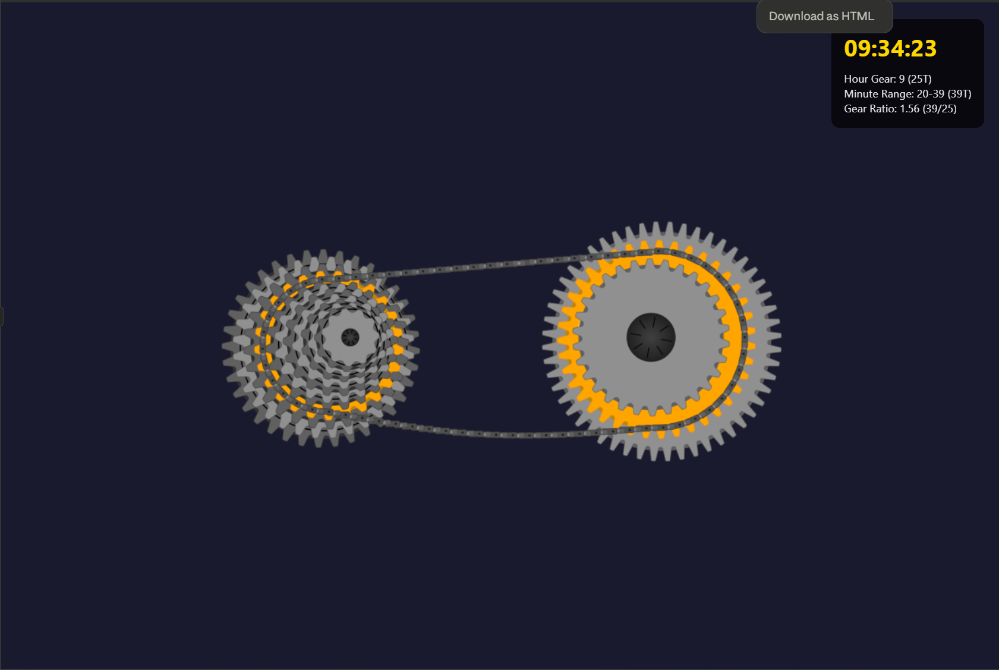

# ⚙️ Bicycle Gear Clock - Animated Desktop Wallpaper

A unique animated clock that displays time using a realistic bicycle drivetrain. The rear cassette shows hours (1-12) and the front chainrings show 20-minute intervals.

## 🎥 Features

- **Realistic Bicycle Drivetrain**: 11-36T rear cassette and 30/39/52T triple chainrings
- **Smooth Animations**: Gears and chain move in perfect synchronization
- **Active Gear Highlighting**: Current time gears glow in gold
- **Detailed Chain Links**: Individual chain plates and rollers with realistic movement
- **Automatic Gear Shifting**: Animated transitions when time changes
- **Gear Ratio Display**: Shows actual mechanical advantage

## ⏰ How It Works

- **Rear Cassette (Left)**: 12 cogs representing hours
  - Smallest cog = 1 o'clock
  - Largest cog = 12 o'clock
- **Front Chainrings (Right)**: 3 rings for 20-minute segments
  - Small ring (30T) = 0-19 minutes
  - Medium ring (39T) = 20-39 minutes
  - Large ring (52T) = 40-59 minutes

## 💾 Installation Methods

### Method 1: Lively Wallpaper (FREE - Recommended)

1. **Install Lively Wallpaper**
   - Download from [Microsoft Store](https://www.microsoft.com/store/productId/9NTM2QC6QWS7)
   - Or from [Official Website](https://www.rocksdanister.com/lively/)

2. **Download the Clock**
   - Download `bicycle-gear-clock.html` from [Releases](https://github.com/YOUR_USERNAME/bicycle-gear-clock/releases)

3. **Add to Lively**
   - Open Lively Wallpaper
   - Click the "+" button
   - Select "Add Webpage/HTML"
   - Browse to `bicycle-gear-clock.html`
   - Click "Set as Wallpaper"

### Method 2: Wallpaper Engine (Steam - $3.99)

1. **Own Wallpaper Engine on Steam**

2. **Download the Clock**
   - Download the `wallpaper-engine` folder from this repository

3. **Import to Wallpaper Engine**
   - Open Wallpaper Engine
   - Click "Open from File"
   - Select the folder
   - Apply as wallpaper

### Method 3: Web Browser (Testing)

Simply open `bicycle-gear-clock.html` in any modern web browser to preview the clock.

## 🖥️ System Requirements

- Windows 10/11
- Modern web browser (Chrome, Firefox, Edge)
- For wallpaper use: Lively Wallpaper or Wallpaper Engine

## 📦 Quick Download

### [⬇️ Download Latest Release](https://github.com/YOUR_USERNAME/bicycle-gear-clock/releases/latest)

## 🛠️ Customization

To customize colors or behavior, edit `bicycle-gear-clock.html`:

- **Background Gradient**: Line ~10 (CSS body background)
- **Gear Colors**: Search for "gradient.addColorStop"
- **Animation Speed**: Search for "wheelRotation +"
- **Chain Color**: Search for "fillStyle = '#505050'"

## 📸 Screenshots

## 🤝 Contributing

Feel free to fork this repository and submit pull requests with improvements!

## 📄 License

MIT License - Feel free to use and modify!

## 🙏 Acknowledgments

Created with passion for cycling and unique time displays.

---

**Enjoy your unique bicycle gear clock!** 🚴‍♂️⏰
